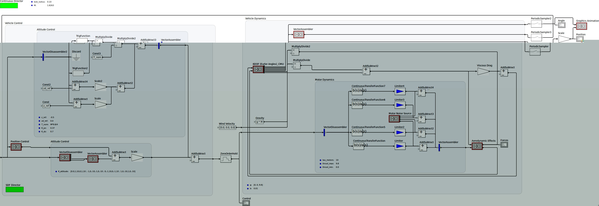

# Port Constraints in the Layer-Based Suggestion to Graph Drawing

This document explores the integration of **port constraints** into the layer-based graph drawing approach (Sugiyama-style layout), specifically detailing the implementation in the **KLay Layered** algorithm (now part of ELK).

## Abstract
Complex software systems are often modeled using *data flow diagrams*, in which nodes are connected through dedicated points called *ports*. In this paper, we present approaches for integrating port constraints into the layer-based approach. We show how KLay Layered progresses from relaxed to restricted port constraint levels and how crossing minimization and edge routing are extended to support these constraints.

Compared to previous algorithms, our approach produces fewer edge crossings and bends, yielding more aesthetically pleasing results.

## Introduction
Graphical diagrams are essential representations for simulators and code generators in embedded software domains like automotive and aerospace. Readability of these diagrams strongly depends on their layout. Since actors in data flow diagrams are connected via ports, layout algorithms must provide native support for them.

### KLay Layered Algorithm
The KLay Layered algorithm addresses the challenges of port constraints by structuring the layout process into a modular pipeline of *intermediate processors*. This allows for flexibility in handling various constraint levels:
- **Free:** The algorithm decides the side and position.
- **Fixed Side:** The side is fixed, but position is free.
- **Fixed Order:** Side and relative order are fixed.
- **Fixed Ratio/Position:** Exact placement is predefined.

*Comparison of port placement methods: (a) Even distribution vs (b) Optimized for edge length.*

## Case Study: Ptolemy II Integration
The algorithm has been successfully integrated into UC Berkeley's **Ptolemy II** tool. Ptolemy models often use specific features like relation vertices and multiports, which our algorithm handles natively.

*Figure 13: A Ptolemy model demonstrating parallel execution, laid out using KLay Layered.*

## Evaluation
The algorithm was evaluated against hundreds of models from the Ptolemy project. The results demonstrated a significant reduction in edge crossings and bends while maintaining competitive execution time suitable for interactive modeling.

*Figure 17a: Guarded Count (SR domain) example.*

*Figure 17b: Complex Ptolemy model showing optimized hierarchical layout.*

---
*Based on the paper: "Port Constraints in the Layer-Based Suggestion to Graph Drawing" by Christoph Daniel Schulze, Miro Spönemann, and Reinhard von Hanxleden.*
